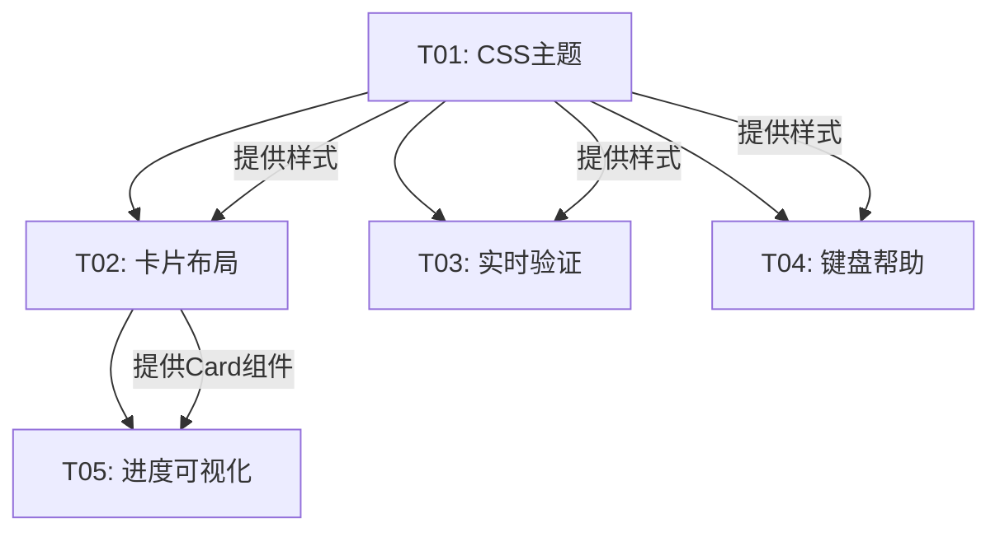

# sim_platform TUI 优化技术方案

> 架构师：高见远  
> 版本：v1.0  
> 日期：2026-05-31

---

## 1. 架构概览

### 1.1 现有架构分析

```
tools/tui/
├── app.py              # SimPlatformTUI (App) + TUI_CSS 全局样式
├── utils.py            # guard_float, MOTOR_PRESETS, SCENARIOS, SCAN_PARAMS
├── screens/
│   ├── main.py         # MainScreen - 静态文本预设 + 按钮导航
│   ├── config.py       # ConfigScreen - Select/Input 表单 + 基础验证
│   ├── run.py          # RunScreen - ProgressBar + RichLog + 异步仿真
│   ├── results.py      # ResultsScreen - DataTable 指标展示
│   └── scan.py         # ScanScreen - 参数扫描 + 进度
└── widgets/
    └── dialogs.py      # ErrorDialog / ConfirmDialog (ModalScreen)
```

**当前问题识别**：
| 问题 | 位置 | 影响 |
|------|------|------|
| CSS主题过时 | app.py TUI_CSS | 视觉体验差，无层次感 |
| 预设场景为静态文本 | main.py Static widget | 无法交互选择，需手动配置 |
| 表单验证延迟 | config.py | 提交时报错，无实时反馈 |
| 键盘提示不全 | 各屏幕 | 新用户学习成本高 |
| 无卡片布局 | main.py | 信息密度过低/高，缺少分区 |
| 进度信息简单 | run.py | 仅百分比，无预估/速度/阶段 |
| 结果无可视化 | results.py | 仅DataTable，无趋势图 |
| 帮助系统缺失 | config.py action_show_help | 固定文本，无上下文感知 |

### 1.2 优化后架构

```
tools/tui/
├── app.py              # SimPlatformTUI (App) - 新主题 + 帮助系统入口
├── theme.py            # [新增] 现代化 CSS 主题常量 + 设计令牌
├── utils.py            # 保留 + 新增验证辅助函数
├── screens/
│   ├── main.py         # MainScreen - 卡片布局 + 交互式预设选择器
│   ├── config.py       # ConfigScreen - 实时验证 + 状态指示器
│   ├── run.py          # RunScreen - 多阶段进度 + 内联统计
│   ├── results.py      # ResultsScreen - 指标卡片 + 简化图表
│   └── scan.py         # ScanScreen - 改进进度 + 结果摘要
├── widgets/
│   ├── dialogs.py      # ErrorDialog / ConfirmDialog - 新样式
│   ├── cards.py        # [新增] 通用卡片组件 (InfoCard, StatCard)
│   ├── validators.py   # [新增] 实时验证组件 + 状态指示器
│   ├── help_panel.py   # [新增] 上下文帮助面板
│   └── sparkline.py    # [新增] 简化图表/趋势线组件
└── data/
    └── help_content.py # [新增] 各屏幕的F1帮助内容
```

### 1.3 核心设计决策

| 决策 | 选择 | 理由 |
|------|------|------|
| CSS方案 | Textual CSS + 设计令牌 | 原生支持，性能最优，主题可复用 |
| 卡片组件 | 继承 Static + Container | 轻量级，Textual原生，易于样式控制 |
| 验证机制 | Input.on_change + Reactive属性 | Textual内置响应式，无需额外依赖 |
| 帮助系统 | ModalScreen + 本地数据 | 简单可靠，离线可用，上下文切换快 |
| 图表方案 | Rich Bar + ASCII art | TUI环境最优解，零依赖，性能好 |

---

## 2. 任务分解

### 任务总览

| 任务ID | 任务名称 | 优先级 | 涉及文件数 | 预估工作量 |
|--------|----------|--------|-----------|-----------|
| T01 | 现代化CSS主题 + 设计令牌 | P0 | 3 | 中 |
| T02 | 交互式预设场景 + 卡片布局 | P0 | 4 | 中 |
| T03 | 实时表单验证 + 状态反馈 | P0 | 3 | 中 |
| T04 | 键盘导航增强 + 上下文帮助 | P0 | 4 | 小 |
| T05 | 进度反馈增强 + 结果可视化 | P1 | 4 | 中 |

### 任务详情

#### T01: 现代化CSS主题 + 设计令牌
**目标**：重新设计全局CSS，采用现代终端UI设计语言
**涉及文件**：
- `tools/tui/theme.py` [新建]
- `tools/tui/app.py` [修改] - CSS引用
- `tools/tui/widgets/dialogs.py` [修改] - 新样式适配

**任务内容**：
1. 创建 `theme.py` 定义设计令牌（颜色、间距、边框）
2. 重写 `TUI_CSS` 全局样式表
3. 添加组件级样式（按钮悬停、焦点环、禁用态）
4. 实现暗色主题优化（对比度、可读性）
5. 更新 dialogs.py 样式适配新主题

---

#### T02: 交互式预设场景 + 卡片布局
**目标**：主屏幕采用卡片式布局，预设场景可交互选择
**涉及文件**：
- `tools/tui/screens/main.py` [修改]
- `tools/tui/widgets/cards.py` [新建]
- `tools/tui/utils.py` [修改] - 预设数据增强
- `tools/tui/screens/config.py` [修改] - 预设接收

**任务内容**：
1. 创建 `cards.py` 实现 InfoCard / StatCard 组件
2. 重写 MainScreen 布局为卡片网格
3. 将静态预设文本改为可交互 OptionList
4. 添加场景描述、参数预览到卡片
5. 实现预设选择 → ConfigScreen 的数据传递

---

#### T03: 实时表单验证 + 状态反馈
**目标**：输入字段实时验证，提供视觉即时反馈
**涉及文件**：
- `tools/tui/widgets/validators.py` [新建]
- `tools/tui/screens/config.py` [修改]
- `tools/tui/utils.py` [修改] - 验证工具函数

**任务内容**：
1. 创建 `validators.py` 实现 ValidatedInput 组件
2. 实现 Input.on_change 实时验证逻辑
3. 添加验证状态指示器（✓/✗ 图标 + 颜色）
4. 添加边界范围提示文字
5. 改进 Select 组件联动（场景→参数自动填充）

---

#### T04: 键盘导航增强 + 上下文帮助
**目标**：完善快捷键，F1显示当前屏幕帮助
**涉及文件**：
- `tools/tui/widgets/help_panel.py` [新建]
- `tools/tui/data/help_content.py` [新建]
- `tools/tui/app.py` [修改] - 帮助入口
- `tools/tui/screens/*.py` [修改] - 绑定增强

**任务内容**：
1. 创建 `help_content.py` 存储各屏幕帮助文本
2. 创建 `help_panel.py` 实现 HelpPanel (ModalScreen)
3. 为每个屏幕添加 F1 绑定和帮助内容
4. 增加 Tab/Shift+Tab 焦点导航
5. 添加底部快捷键提示栏

---

#### T05: 进度反馈增强 + 结果可视化
**目标**：仿真运行时更丰富进度，结果页内联图表
**涉及文件**：
- `tools/tui/screens/run.py` [修改]
- `tools/tui/screens/results.py` [修改]
- `tools/tui/widgets/sparkline.py` [新建]
- `tools/tui/widgets/cards.py` [复用]

**任务内容**：
1. 创建 `sparkline.py` 实现 ASCII 趋势图组件
2. RunScreen 添加多阶段进度（初始化/仿真/保存）
3. 添加实时统计面板（FPS、内存、当前值）
4. ResultsScreen 添加指标卡片布局
5. 在结果页内联显示速度/电流趋势图

---

## 3. 技术方案

### 3.1 P0-01 现代化CSS主题

#### 设计令牌体系 (theme.py)

```python
# 颜色系统 - 基于 Textual 设计令牌扩展
COLORS = {
    # 主色调
    "primary": "#6366f1",       # Indigo-500
    "primary-hover": "#818cf8", # Indigo-400
    "primary-muted": "#4f46e5", # Indigo-600
    
    # 语义色
    "success": "#22c55e",
    "warning": "#f59e0b",
    "error": "#ef4444",
    "info": "#3b82f6",
    
    # 中性色
    "surface": "#1e1e2e",       # 深色底
    "surface-hover": "#313244",
    "border": "#45475a",
    "text": "#cdd6f4",
    "text-muted": "#a6adc8",
    "text-disabled": "#585b70",
    
    # 强调色
    "accent": "#f5c2e7",        # Pink
    "accent-secondary": "#94e2d5", # Teal
}

# 间距系统
SPACING = {
    "xs": "0 1",    # 极小
    "sm": "1 2",    # 小
    "md": "2 3",    # 中
    "lg": "3 4",    # 大
}

# 圆角 / 边框
BORDERS = {
    "card": "round $border",
    "panel": "tall $border",
    "input": " tall $primary",
}
```

#### CSS策略

```css
/* ── 全局基础 ── */
Screen {
    background: $surface;
    color: $text;
}

/* ── 卡片组件 ── */
.card {
    background: $surface-hover;
    border: round $border;
    padding: 1 2;
    margin: 0 1;
    min-height: 8;
}
.card:hover {
    border: round $primary;
}
.card-title {
    text-style: bold;
    color: $primary;
    margin-bottom: 1;
}

/* ── 按钮状态 ── */
Button {
    background: $primary;
    color: $text;
    border: none;
    padding: 0 2;
}
Button:hover {
    background: $primary-hover;
}
Button:focus {
    border: tall $accent;
}
Button:disabled {
    background: $surface;
    color: $text-disabled;
}

/* ── 输入验证状态 ── */
Input.-valid {
    border: tall $success;
}
Input.-invalid {
    border: tall $error;
}
.validation-hint {
    color: $text-muted;
    margin-top: 0;
}
.validation-error {
    color: $error;
    margin-top: 0;
}
```

#### 实现要点
- 使用Textual CSS变量系统 `$variable` 实现主题一致性
- 所有颜色定义集中在 `theme.py` 便于维护
- 通过CSS类 `.card`, `.stat-card` 统一组件样式
- 支持未来扩展多主题

---

### 3.2 P0-02 交互式预设场景

#### 组件设计

```python
# widgets/cards.py
class InfoCard(Static):
    """信息卡片组件"""
    
    def __init__(self, title: str, description: str, 
                 icon: str = "📋", selectable: bool = False):
        super().__init__()
        self.title = title
        self.description = description
        self.icon = icon
        self.selectable = selectable
        self.selected = False
    
    def compose(self) -> ComposeResult:
        yield Static(f"{self.icon} {self.title}", classes="card-title")
        yield Static(self.description, classes="card-desc")
    
    def on_click(self) -> None:
        if self.selectable:
            self.selected = not self.selected
            self.toggle_class("selected")
            self.post_message(self.Selected(self))
```

#### 主屏幕布局重构

```python
# screens/main.py - 新布局
def compose(self) -> ComposeResult:
    yield Header(show_clock=True)
    yield Container(
        # 顶部状态栏
        Horizontal(
            Static("⚡ sim_platform", id="app-title"),
            Static("v2.0", id="app-version"),
            classes="header-bar"
        ),
        
        # 快速操作卡片行
        Horizontal(
            InfoCard("运行仿真", "配置并执行一次仿真", "🚀"),
            InfoCard("参数扫描", "批量参数扫描对比", "📊"),
            InfoCard("系统状态", "查看模型和引擎信息", "ℹ️"),
            classes="card-row",
        ),
        
        # 预设场景选择器
        Static("[bold]预设场景[/]", classes="section-title"),
        OptionList(
            Option("Step Response - 100 rad/s 阶跃响应", id="step"),
            Option("Ramp Test - 0→100 平滑加速", id="ramp"),
            Option("Load Disturbance - 0.3 N*m 负载扰动", id="load"),
            Option("Voltage Sag - 电压暂降恢复测试", id="sag"),
            id="scenario-selector",
        ),
        
        # 底部快捷键
        Horizontal(
            Static("[dim]R[/] 运行"),
            Static("[dim]C[/] 配置"),
            Static("[dim]S[/] 扫描"),
            Static("[dim]F1[/] 帮助"),
            classes="shortcut-bar",
        ),
        classes="main-container",
    )
    yield Footer()
```

#### 数据流

```
MainScreen (OptionList选择)
    ↓ post_message(ScenarioSelected)
MainScreen._on_scenario_selected()
    ↓ 构建config dict
ConfigScreen.set_preset(config)
    ↓ 跳转
ConfigScreen (自动填充参数)
```

---

### 3.3 P0-03 实时表单验证

#### ValidatedInput 组件

```python
# widgets/validators.py
class ValidatedInput(Container):
    """带实时验证的输入框"""
    
    VALID_CSS_CLASS = "-valid"
    INVALID_CSS_CLASS = "-invalid"
    
    def __init__(self, label: str, value: str, 
                 min_val: float, max_val: float, 
                 unit: str = "", id: str = None):
        super().__init__(id=id)
        self.label_text = label
        self.initial_value = value
        self.min_val = min_val
        self.max_val = max_val
        self.unit = unit
        self.is_valid = True
    
    def compose(self) -> ComposeResult:
        yield Label(f"{self.label_text} ({self.min_val}-{self.max_val} {self.unit})")
        yield Input(value=self.initial_value, type="number", 
                    id=f"input-{self.id}")
        yield Static("", classes="validation-hint", id=f"hint-{self.id}")
    
    def on_input_changed(self, event: Input.Changed) -> None:
        """实时验证"""
        value = event.value
        if not value:
            self._set_state(False, "请输入数值")
            return
        
        try:
            num = float(value)
            if math.isnan(num) or math.isinf(num):
                self._set_state(False, "不能为 NaN/Inf")
            elif num < self.min_val:
                self._set_state(False, f"不能小于 {self.min_val}")
            elif num > self.max_val:
                self._set_state(False, f"不能大于 {self.max_val}")
            else:
                self._set_state(True, "✓")
        except ValueError:
            self._set_state(False, "无效数值")
    
    def _set_state(self, valid: bool, hint: str) -> None:
        self.is_valid = valid
        input_widget = self.query_one(Input)
        hint_widget = self.query_one(f"#hint-{self.id}", Static)
        
        input_widget.set_class(valid, self.VALID_CSS_CLASS)
        input_widget.set_class(not valid, self.INVALID_CSS_CLASS)
        hint_widget.update(hint)
```

#### 验证流程

```
用户输入 → Input.on_change → ValidatedInput.on_input_changed()
    ↓
验证逻辑 (范围/NaN/类型)
    ↓
更新 CSS 类 + 提示文字
    ↓
ConfigScreen._validate_and_run() 最终检查
```

---

### 3.4 P0-04 键盘导航增强

#### 快捷键体系

| 屏幕 | 快捷键 | 功能 |
|------|--------|------|
| 全局 | Ctrl+Q | 退出 |
| 全局 | Ctrl+H | 返回主页 |
| 全局 | Ctrl+L | 返回上一级 |
| 全局 | F1 | 上下文帮助 |
| 全局 | Tab/Shift+Tab | 焦点切换 |
| MainScreen | R | 运行仿真 |
| MainScreen | C | 配置参数 |
| MainScreen | S | 参数扫描 |
| ConfigScreen | Enter | 确认运行 |
| ConfigScreen | Escape | 取消/返回 |
| RunScreen | Space | 暂停/继续 |
| ResultsScreen | P | 生成图表 |
| ResultsScreen | R | 重新运行 |

#### HelpPanel 实现

```python
# widgets/help_panel.py
class HelpPanel(ModalScreen):
    """上下文帮助面板"""
    
    def __init__(self, screen_name: str):
        super().__init__()
        self.screen_name = screen_name
    
    def compose(self) -> ComposeResult:
        content = HELP_CONTENT.get(self.screen_name, {})
        yield Grid(
            Static(f"[bold]📖 {content.get('title', '帮助')}[/]", 
                   classes="help-title"),
            Static(content.get('description', ''), classes="help-desc"),
            # 快捷键列表
            *self._render_shortcuts(content.get('shortcuts', [])),
            Horizontal(
                Button("关闭 [dim]Esc[/]", variant="default", id="close"),
                classes="button-row",
            ),
            classes="help-panel",
        )
    
    def _render_shortcuts(self, shortcuts: list) -> list:
        rows = []
        for key, desc in shortcuts:
            rows.append(
                Static(f"  [bold]{key}[/]  {desc}")
            )
        return rows
```

#### 帮助内容示例

```python
# data/help_content.py
HELP_CONTENT = {
    "MainScreen": {
        "title": "主屏幕帮助",
        "description": "sim_platform 多物理域联合仿真平台主界面。\n"
                      "选择预设场景快速开始，或进入配置自定义参数。",
        "shortcuts": [
            ("R", "运行仿真"),
            ("C", "配置参数"),
            ("S", "参数扫描"),
            ("↑/↓", "选择预设"),
            ("Enter", "确认选择"),
            ("F1", "显示帮助"),
        ]
    },
    "ConfigScreen": {
        "title": "参数配置帮助",
        "description": "配置仿真参数。所有输入框支持实时验证。\n"
                      "红色边框表示输入无效，绿色表示有效。",
        "shortcuts": [
            ("Tab", "切换字段"),
            ("Enter", "运行仿真"),
            ("Escape", "返回"),
            ("F1", "显示帮助"),
        ]
    },
    # ... 其他屏幕
}
```

---

### 3.5 P1-05 进度反馈增强

#### RunScreen 多阶段进度

```python
# run.py - 进度阶段
class SimPhase(Enum):
    INIT = "初始化"
    RUNNING = "仿真运行"
    SAVING = "保存结果"
    PLOTTING = "生成图表"

# 进度面板布局
def compose(self) -> ComposeResult:
    yield Header(show_clock=True)
    yield Container(
        # 阶段指示器
        Horizontal(
            Static("● 初始化", classes="phase"),
            Static("● 仿真", classes="phase"),
            Static("● 保存", classes="phase"),
            id="phase-indicator",
        ),
        
        # 主进度条
        ProgressBar(total=100, show_eta=True, id="progress"),
        
        # 实时统计卡片
        Horizontal(
            InfoCard("速度", "0 rad/s", "⚡", id="stat-speed"),
            InfoCard("转矩", "0 N*m", "🔧", id="stat-torque"),
            InfoCard("FPS", "0 steps/s", "📊", id="stat-fps"),
            classes="stat-row",
        ),
        
        # 日志
        RichLog(max_lines=200, highlight=True, markup=True, id="run-log"),
        
        # 按钮
        Horizontal(
            Button("查看结果", variant="primary", id="view-results", disabled=True),
            Button("重新运行", variant="default", id="run-again"),
            Button("返回", variant="default", id="back"),
            classes="button-row",
        ),
        classes="run-container",
    )
    yield Footer()
```

#### 进度更新逻辑

```python
@work
async def run_simulation(self) -> None:
    # Phase 1: 初始化
    self._set_phase(SimPhase.INIT)
    # ... 初始化模型 ...
    await asyncio.sleep(0)
    
    # Phase 2: 仿真运行
    self._set_phase(SimPhase.RUNNING)
    for step in range(total_steps):
        # ... 仿真逻辑 ...
        if step % update_interval == 0:
            # 更新统计卡片
            self._update_stat("stat-speed", f"{motor.omega_m:.1f} rad/s")
            self._update_stat("stat-torque", f"{motor.torque:.3f} N*m")
            self._update_stat("stat-fps", f"{fps:.0f} steps/s")
            await asyncio.sleep(0)
    
    # Phase 3: 保存
    self._set_phase(SimPhase.SAVING)
    # ... 保存HDF5 ...
    
    # Phase 4: 完成
    self._set_phase(None)  # 清除阶段指示
```

---

### 3.6 P1-06 结果可视化增强

#### SparkLine 组件

```python
# widgets/sparkline.py
class SparkLine(Static):
    """ASCII 趋势图组件"""
    
    BLOCKS = " ▁▂▃▄▅▆▇█"  # 8级高度
    
    def __init__(self, data: list[float], width: int = 40, 
                 height: int = 6, label: str = ""):
        super().__init__()
        self.data = data
        self.width = width
        self.height = height
        self.label = label
    
    def render(self) -> str:
        if not self.data:
            return ""
        
        # 采样到指定宽度
        sampled = self._sample(self.data, self.width)
        
        # 归一化到 [0, 1]
        min_val = min(sampled)
        max_val = max(sampled)
        range_val = max_val - min_val or 1
        normalized = [(v - min_val) / range_val for v in sampled]
        
        # 渲染ASCII
        lines = []
        for row in range(self.height, 0, -1):
            threshold = row / self.height
            line = ""
            for val in normalized:
                if val >= threshold:
                    line += "█"
                else:
                    line += " "
            lines.append(line)
        
        # 添加标签和范围
        result = "\n".join(lines)
        if self.label:
            result = f"[bold]{self.label}[/]\n{result}"
        result += f"\n[min:{min_val:.1f} max:{max_val:.1f}]"
        
        return result
    
    def _sample(self, data: list, n: int) -> list:
        """均匀采样"""
        if len(data) <= n:
            return data
        step = len(data) / n
        return [data[int(i * step)] for i in range(n)]
```

#### ResultsScreen 增强

```python
# results.py - 增强布局
def compose(self) -> ComposeResult:
    yield Header(show_clock=True)
    yield Container(
        Static("[bold green]仿真结果[/]", id="results-title"),
        
        # KPI 卡片行
        Horizontal(
            InfoCard("最终速度", "", "⚡", id="kpi-speed"),
            InfoCard("跟踪误差", "", "🎯", id="kpi-error"),
            InfoCard("峰值转矩", "", "🔧", id="kpi-torque"),
            InfoCard("峰值电流", "", "⚡", id="kpi-current"),
            classes="kpi-row",
        ),
        
        # 趋势图
        Horizontal(
            SparkLine([], label="速度趋势", id="spark-speed"),
            SparkLine([], label="电流趋势", id="spark-current"),
            classes="chart-row",
        ),
        
        # 详细数据表
        DataTable(id="metrics-table"),
        
        # 操作按钮
        Horizontal(
            Button("重新运行", variant="primary", id="rerun"),
            Button("生成图表", variant="success", id="plot"),
            Button("返回主页", variant="default", id="back"),
            classes="button-row",
        ),
        classes="results-container",
    )
    yield Footer()
```

---

## 4. 文件清单

### 新增文件

| 文件路径 | 职责 | 主要内容 |
|----------|------|----------|
| `tools/tui/theme.py` | 设计令牌 + CSS常量 | 颜色、间距、边框定义 |
| `tools/tui/widgets/cards.py` | 卡片组件 | InfoCard, StatCard |
| `tools/tui/widgets/validators.py` | 验证组件 | ValidatedInput, 验证状态指示 |
| `tools/tui/widgets/help_panel.py` | 帮助面板 | HelpPanel (ModalScreen) |
| `tools/tui/widgets/sparkline.py` | 趋势图组件 | SparkLine ASCII图表 |
| `tools/tui/data/help_content.py` | 帮助内容 | 各屏幕帮助文本数据 |

### 修改文件

| 文件路径 | 变更内容 |
|----------|----------|
| `tools/tui/app.py` | 引用新CSS，添加F1帮助入口 |
| `tools/tui/utils.py` | 新增验证辅助函数，增强预设数据 |
| `tools/tui/screens/main.py` | 卡片布局 + 交互式预设选择器 |
| `tools/tui/screens/config.py` | 实时验证集成 + 预设接收 |
| `tools/tui/screens/run.py` | 多阶段进度 + 统计面板 |
| `tools/tui/screens/results.py` | 指标卡片 + SparkLine集成 |
| `tools/tui/screens/scan.py` | 样式适配 + 进度增强 |
| `tools/tui/widgets/dialogs.py` | 新主题样式适配 |
| `tools/tui/screens/__init__.py` | 无变更（保持兼容） |
| `tools/tui/widgets/__init__.py` | 新增导出 |

---

## 5. 实现顺序

### 推荐实施路径

```
T01 (CSS主题) ──┬──→ T02 (卡片布局) ──→ T05 (进度+可视化)
                │
                └──→ T03 (实时验证)
                │
                └──→ T04 (键盘+帮助)
```

### 并行任务分析

| 阶段 | 可并行任务 | 说明 |
|------|-----------|------|
| 阶段1 | T01 | 基础主题，其他任务依赖 |
| 阶段2 | T02, T03, T04 | 三者相互独立，可并行 |
| 阶段3 | T05 | 依赖T02的卡片组件 |

### 详细依赖关系



---

## 6. 风险和注意事项

### 技术风险

| 风险 | 等级 | 影响 | 应对措施 |
|------|------|------|----------|
| Textual CSS限制 | 中 | 某些样式可能无法实现 | 降级为可用方案，保持功能完整 |
| 性能问题 | 低 | 大量Widget可能卡顿 | 控制Widget数量，使用懒加载 |
| 兼容性问题 | 中 | 现有测试可能失败 | 保持API兼容，增量修改 |
| Unicode渲染 | 低 | 不同终端渲染差异 | 提供ASCII降级方案 |

### 实施建议

1. **渐进式实现**：先完成T01主题，再逐步添加功能
2. **保持兼容**：所有修改不改变公共API，测试应继续通过
3. **性能监控**：每个任务完成后运行基准测试
4. **用户测试**：每个P0任务完成后进行交互测试

### 验收标准

- [ ] 所有现有测试通过
- [ ] P0需求100%实现
- [ ] P1需求80%实现
- [ ] 无性能退化（启动时间 < 2s）
- [ ] 键盘导航完整可用

---

## 附录

### A. 设计令牌完整定义

见 `theme.py` 实现代码。

### B. Textual CSS 参考

- 官方文档：https://textual.textualize.io/css/
- 设计令牌：https://textual.textualize.io/css/variables/
- 组件样式：https://textual.textualize.io/css/types/

### C. 现有测试兼容性

现有测试 `test_tui.py` 和 `test_tui_ux.py` 主要验证：
- Widget ID 存在性
- 方法存在性
- 绑定存在性
- CSS 类存在性

所有修改将保持这些检查点不变，确保测试通过。
